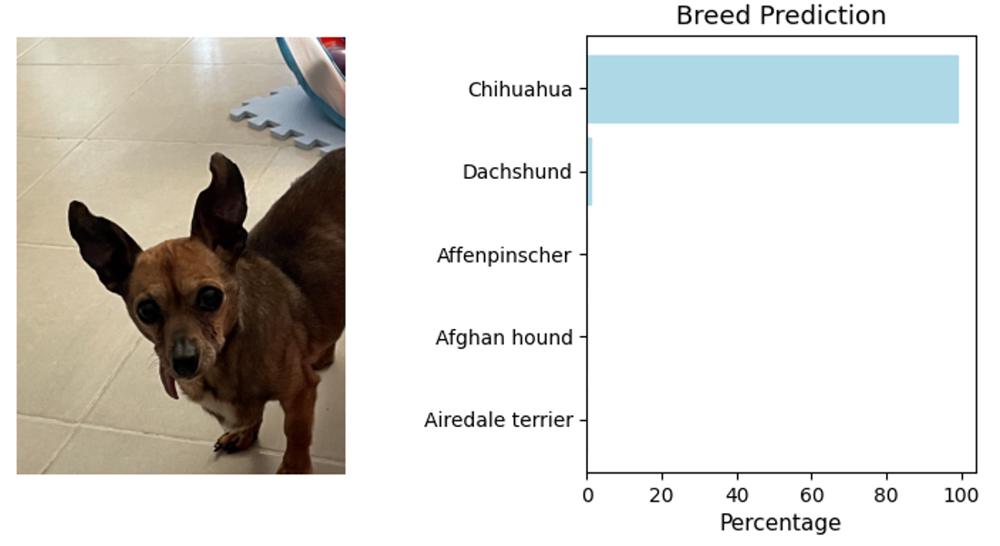

# Dog Breed WebApp Classifier
Convolutional Neural Network for image classification using Transfer Learning  
Deployment in WebApp 
Date: 28-Jun-2023

## Project Definition
### Overview
In this project I’ll create a deep learning algorithm for image classification, by creating a model from scratch and using transfer learning from models like ResNet50, VGG16 and InceptionV3, the dataset to be used is from Udacity with 8,351 dog images from 133 categories of dog breeds.
The objective is to create a convolutional neural network for image classification to detect the features of a dog or a human a predict the breeds according to the image features, the deployment is in a web application using flask.
### Problem
An image classification problem can help you solve different type of tasks like face recognition, item classification, error detection, among others. Using transfer learning not only can it help us boost the accuracy of our neural network, but also reduce the learning time and increase the features detection.
### Metrics
For the metrics the classification accuracy will tell us how many correct predictions our model has from the total number of predictions. For these models it is recommendable to use it for the train, validation and test image dataset.
## Analysis
### Data Exploration:
As the web app will be built to detect human face features and predict a dog breed, first a `face_detector` was built using the pre trained model from OpenCV and a dataset of 100 pictures of humans was used. With the `face_detector` we can detect in all of the human images a human face, giving us 100% detection rate with the sample images. However, we also incorrectly detect a human face in 11% of the dog images.  
To analyze the dog images quality a `dog_detector` function was created with the ResNet-50 pretrained model, with the `dog_detector` we can detect in all of the dog images a dog, giving us 100% detection rate with the sample images, and we didn't detect any dog in the human faces images. 
### Process:
1. Create models for `face_detector` and `dog_detector`.
2. Create a deep learning models from scratch and using transfer learning for `dog_breed` classification.
3. Create a pipeline for image classification using all the models with the output of the top 5 predicted breeds.
3. Deploy the model as a Web App using Flask.

## Conclusion
### Results
Model from Scratch, a CNN model with 3 convolutions and a Dense layer with a test accuracy of 1.19%.  
Model with transfer learning from VGG-16 and a test accuracy of 41.98%.  
Model with transfer learning from InceptionV3 and a test accuracy of 80.74%.  
The model used for the deployment was the InceptionV3 model with an accuracy of 80.74% in the test images.

 
<b>Fig.1</b> - Result from a Dog Picture

 
<b>Fig.2</b> - Result from a Human Picture

### Improvement Opportunities
One test I included was a rotated picture of my dog which also as expected the model couldn't detect as a dog, to solve this problem before training the model some data augmentation could be done to the train pictures like rotation, displacement, zoom or tilt.  
A second area of opportunity I see for this model is that we used the bottleneck features using the complete InceptionV3 model, instead of doing this we could freeze only some layer for training or change other that could help us detect only the features of the dog breeds better.  
Finally, this model only works for 133 breeds of dogs and there are around 450 total breeds, so the model could be fed with additional classes of breeds or another animal to avoid miss classifying a wolf or a cat as a dog.

## Project Information
### Main Libraries used
Flask==2.3.2  
matplotlib==3.7.1   
opencv-python==4.7.0.72  
tensorflow==2.12.0  
The complete set of libraries can be found in the requirements.txt file

### Files Description
<b>app.py:</b> Python file to execute the Web App 
<b>Dog_App.ipynb:</b> Jupyter Notebook file with all the process for training the models 
<b>requirements.txt:</b> List of libraries used in this project 
<b>app/</b>
<ul>
  <li><b>routes.py:</b> Flask file with the routes and functions for all the application</li>
</ul>
<b>app/models/</b>
<ul>
  <li><b>haarcascade_frontalface_alt.xml:</b> OpenCV model for frontal face classification</li>
  <li><b>model.InceptionV3.h5:</b> Model created for dog breed classification using transfer learning</li>
</ul>
<b> app/static/</b>
<ul>
  <li><b>dog_names.csv:</b> List of all the 133 dog breeds used for the model</li>
  <li><b>example_beagle.png:</b> image of a dog as example for the model</li>
  <li><b> example_none.png:</b> landscape image for an error example for the model </li>
  <li><b> example_priest.png:</b> image of a priest as example for the model </li>
  <li><b> index_images/:</b> folder with the images shown in the index.html file </li>
</ul>
<b>app/temp/:</b> Folder for saving the image to use for classification 
<b>app/templates/</b>
<ul>
<li><b> index.html:</b> HTML file for the main page and instructions</li>
<li><b> layout.html:</b> HTML file of the layout of all pages in the app</li>
<li><b> predict.html:</b> HTML file to display the text input and classification result </li>
</ul>

### Acknowledgements
[Udacity](http://udacity.com/) thanks for sharing the dog image dataset for training and the bottleneck features used to create this project.
